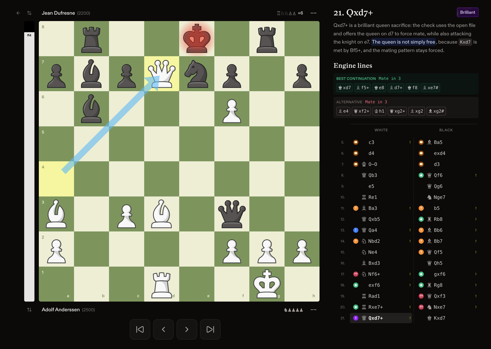

# [g6](https://g6chess.com): Free Chess Analysis



Public frontend for g6, an evidence-grounded chess analysis product.

The app lets someone paste a Chess.com or Lichess game link, open a
`g6chess.com/game/live/...` or `g6chess.com/lichess/...` route, or paste PGN. It
imports the game through the analysis API, polls for completed move analysis,
and renders a board-first review with move labels, engine/book continuations,
and coach-style explanations

## Product Direction

g6 is not an LLM chess calculator, the product boundary is:

```text
Stockfish + human-likelihood evidence + rules + verifiers = chess truth
LLM or deterministic renderer = wording for verified explanations
```

The user question we are trying to answer is:

```text
At this move in my game, what happened, how good was my move, and what should I understand?
```

The frontend turns that into a usable review surface: import a real game,
navigate the move list, inspect critical moments, preview verified lines on the
board, and explore alternatives without losing the main game.

## What Is In This Repo

- Vite + React + TypeScript frontend.
- Chess.com URL, Lichess URL, and PGN import UI.
- Route parsing for shareable game links and selected ply state.
- Polling client for the game-analysis API.
- Board-first analysis workspace with move list, eval bar, player bars,
  explanation panel, opening-book lines, and engine-line previews.
- UltraChess React board integration.
- Browser Stockfish as an exploration fallback for positions not covered by the
  server snapshot.

The repository is useful for working on the public UI and API contract. It is
not enough to run the full g6 analysis product without the private backend.

## Related Work

- [`ultrachess`](https://github.com/yahorbarkouski/ultrachess): Rust/WASM chess
  library with TypeScript bindings for legal move generation, FEN/SAN/PGN, perft,
  and hashing.
- [`ultrachess-react`](https://github.com/yahorbarkouski/ultrachess-react):
  React chessboard subsystem used by this app, with external board state,
  byte-scoped square subscriptions, WAAPI piece animation, and canvas arrows.
- Private g6 explanation engine: evidence packets, move labels, verified
  explanation generation, source-rights policy, and eval infrastructure.
- Older `g6chess-*` repos: product lineage around imports, live-game sync,
  narratives, puzzles, and the broader g6 application.

## Local Development

Install dependencies:

```bash
bun install
```

Start the dev server:

```bash
bun run dev
```

The app runs at:

```text
http://127.0.0.1:5173/
```

Point it at an analysis API with
[If you're interested in the collaboration and contribution, please contact me for private repository access]:
```bash
VITE_G6_API_BASE_URL=http://127.0.0.1:8001
```

Enable Cloudflare Turnstile for anonymous import starts with:

```bash
VITE_G6_TURNSTILE_SITE_KEY=...
```

Expected API shape today:

- `POST /api/game-analysis/import`
- `GET /api/game-analysis/import/chess-com/live/{externalGameId}`
- `GET /api/game-analysis/import/lichess/{externalGameId}`
- polling through the returned `status_url`
- Import responses and game-analysis snapshots include a `game` skeleton with
  PGN-derived SAN/UCI/FEN move data. The client can render the board from that
  skeleton while deeper context and explanations are still pending.
- Normal import requests use `include_context=false`. Completed move snapshots
  include compact board, engine-line, label, and explanation fields for the UI;
  full context packets are reserved for internal/debug tooling.
- Engine `top_lines` describe pre-move alternatives from `fen_before`. When the
  played move matches the best line, the UI pairs that with the next ply's best
  line as a `Best continuation` row and shows the remaining current-position
  alternatives below. The visible row count defaults to two and can be changed
  in board settings. Engine WDL and Maia move-choice probabilities are kept for
  analysis data but are not shown as human win-probability percentages in the
  engine-line list.

## Checks

```bash
bun run typecheck
bun run lint
bun run test
bun run build
```

`bun install` copies the browser Stockfish worker assets into
`public/stockfish/`.
